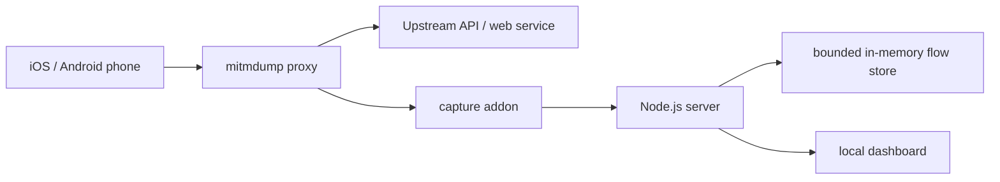

# Rela Capture MVP Design

## Purpose

Rela Capture is a standalone local debugging tool for company app testing. A tester starts the tool on a laptop, keeps the laptop and test phones on the same Wi-Fi, configures each phone to use the laptop as an HTTP proxy, and then inspects captured HTTP and HTTPS requests from a local web dashboard.

The first version proves the full capture flow with the least custom network machinery. It uses mitmproxy as the proxy and TLS interception engine, while this project provides the local launcher, device onboarding guidance, flow collection, filtering, and dashboard UI.

## Goals

- Start the capture stack from this project with one local command.
- Show the laptop LAN IP, proxy port, dashboard URL, and certificate install guidance.
- Capture HTTP and HTTPS traffic from iOS and Android devices that are configured to use the laptop proxy.
- Display requests in a local dashboard with device IP, method, host, path, status, duration, protocol, request details, and response details.
- Filter captured traffic by device IP, host text, and protocol category.
- Provide pause, clear, and JSON export controls.
- Keep the project independent from other Rela repositories.

## Non-Goals For MVP

- Native iOS or Android VPN clients.
- Automatic phone Wi-Fi proxy configuration.
- MDM, supervised-device, or enterprise profile deployment.
- App-side Android `network_security_config` changes.
- SSL pinning bypass or production certificate pinning changes.
- Deep QUIC and HTTP/3 capture. The dashboard will document that UDP 443 may need to be blocked or disabled in test environments to force TCP/TLS fallback.
- Multi-user authentication or hosted deployment. The dashboard binds to local development interfaces and is intended for trusted test networks only.

## Recommended Approach

Use mitmproxy as the capture core and wrap it with a Node.js application:

- `mitmdump` runs as a child process in regular HTTP proxy mode.
- A small Python mitmproxy addon serializes request, response, websocket, and error events as newline-delimited JSON to stdout or a local IPC stream.
- A Node.js server reads those events, normalizes them, keeps an in-memory bounded capture store, and serves HTTP APIs plus a dashboard UI.
- The dashboard connects to the Node.js server through Server-Sent Events or WebSocket for real-time updates.

This keeps the risky protocol work inside mitmproxy and keeps the project code focused on product workflow.

## User Flow

1. The tester runs the local dev command from the project directory.
2. The terminal and dashboard show the detected LAN IP, proxy host, proxy port, dashboard URL, and certificate URL.
3. The tester connects an iOS or Android phone to the same Wi-Fi as the laptop.
4. The tester configures the phone Wi-Fi proxy manually:
   - host: laptop LAN IP
   - port: proxy port
5. The tester opens the certificate install URL on the phone.
6. The tester installs and trusts the mitmproxy CA certificate.
7. The tester opens the app or browser on the phone.
8. The dashboard starts showing captured traffic.
9. The tester filters by host, protocol, or device IP, opens details, pauses capture, clears flows, or exports JSON.

## HTTPS Behavior

HTTPS body capture requires TLS interception:

- The proxy generates or reuses a local mitmproxy CA certificate.
- The phone must install and trust that CA.
- iOS Safari and many iOS app requests will be visible after the CA is trusted.
- Android browser traffic can be visible after the CA is trusted, depending on browser and OS behavior.
- Android app HTTPS traffic on Android 7+ usually requires the app test build to trust user-added CAs.
- Apps with SSL pinning will fail or remain unreadable until a debug/test switch disables pinning or trusts the debug CA.

The MVP will surface these constraints in onboarding text and error hints, but will not modify app code.

## Architecture

### Processes

- Node.js app process
  - starts and monitors mitmdump
  - serves dashboard assets and JSON APIs
  - exposes real-time capture events
  - owns filtering, export, pause, and clear state
- mitmdump child process
  - listens on the configured proxy port
  - handles HTTP and HTTPS proxying
  - runs the capture addon
- mitmproxy Python addon
  - receives flow lifecycle hooks
  - emits compact JSON events to the Node.js process

### Data Flow

### Capture Model

Each captured flow has:

- `id`: mitmproxy flow id
- `clientIp`: source device IP
- `startedAt`: request timestamp
- `durationMs`: response or error duration
- `protocol`: `http`, `https`, `websocket`, or `unknown`
- `method`: HTTP method
- `scheme`: request scheme
- `host`: request host
- `port`: upstream port
- `path`: request path and query
- `statusCode`: response status when available
- `requestHeaders`: normalized header list
- `responseHeaders`: normalized header list
- `requestBodyPreview`: text or base64 preview with truncation metadata
- `responseBodyPreview`: text or base64 preview with truncation metadata
- `error`: proxy or TLS error message when available
- `isTlsIntercepted`: whether mitmproxy could inspect decrypted HTTP details

The in-memory store keeps the most recent flows, with a configurable cap such as 2,000 flows. Large bodies are truncated for UI responsiveness and export safety.

## Dashboard

The dashboard is a utilitarian testing console, not a marketing page.

Primary areas:

- Top status bar:
  - capture state
  - proxy address
  - connected client count
  - buttons for pause/resume, clear, export
- Onboarding panel:
  - laptop IP
  - proxy port
  - certificate URL
  - concise iOS and Android setup steps
- Filter bar:
  - device IP input
  - host contains input
  - protocol segmented control
  - status class selector
- Request table:
  - time
  - device
  - method
  - host
  - path
  - status
  - duration
  - protocol
- Detail drawer:
  - overview
  - request headers
  - request body preview
  - response headers
  - response body preview
  - error details

## APIs

The Node.js server exposes local APIs:

- `GET /api/status`
  - returns proxy port, dashboard port, LAN addresses, capture state, and mitmproxy process state
- `GET /api/flows`
  - returns currently stored flows after query filtering
- `GET /api/flows/:id`
  - returns full details for one flow
- `POST /api/capture/pause`
  - pauses event ingestion while proxy traffic continues
- `POST /api/capture/resume`
  - resumes event ingestion
- `POST /api/flows/clear`
  - clears the in-memory store
- `GET /api/export`
  - downloads filtered flows as JSON
- `GET /api/events`
  - streams live flow updates to the dashboard

## Configuration

Configuration is environment-variable based for the MVP:

- `RELA_CAPTURE_DASHBOARD_HOST`
  - default: `0.0.0.0`
- `RELA_CAPTURE_DASHBOARD_PORT`
  - default: `5177`
- `RELA_CAPTURE_PROXY_HOST`
  - default: `0.0.0.0`
- `RELA_CAPTURE_PROXY_PORT`
  - default: `8088`
- `RELA_CAPTURE_MAX_FLOWS`
  - default: `2000`
- `RELA_CAPTURE_BODY_PREVIEW_BYTES`
  - default: `65536`
- `RELA_CAPTURE_INCLUDE_HOSTS`
  - default: empty, meaning include all hosts
- `RELA_CAPTURE_EXCLUDE_HOSTS`
  - default: empty

## Error Handling

- If the proxy port is occupied, startup fails with a clear message and suggests setting `RELA_CAPTURE_PROXY_PORT`.
- If the dashboard port is occupied, startup fails with a clear message and suggests setting `RELA_CAPTURE_DASHBOARD_PORT`.
- If mitmdump is missing, startup explains how to install project dependencies.
- If no LAN IP is detected, the dashboard still starts and shows localhost plus a warning.
- If the phone cannot connect, the onboarding panel suggests checking same Wi-Fi, client isolation, firewall, host IP, and proxy port.
- If HTTPS fails, the detail view distinguishes common causes:
  - CA not installed or trusted
  - app does not trust user CAs
  - certificate pinning
  - HTTP/3 or QUIC bypassing the HTTP proxy path

## Security And Privacy

- The tool is for trusted internal test networks.
- The dashboard should display a visible warning that captured traffic may contain tokens, PII, and credentials.
- Exports are local JSON files and are not uploaded.
- The MVP does not persist captures to disk automatically.
- The generated CA private key stays in the local mitmproxy configuration directory.
- Users should remove the debugging CA from phones when testing is complete.

## Testing Strategy

- Unit tests for flow normalization, body preview truncation, host filters, protocol classification, and store cap behavior.
- Integration test for reading addon JSON events into the Node.js store.
- Local manual test with `curl` through the proxy for HTTP.
- Local manual test with `curl --proxy` and a trusted mitmproxy CA for HTTPS.
- Device smoke test with one iOS and one Android phone on the same Wi-Fi.

## Future Phases

- QR-code onboarding for proxy address and certificate URL.
- PAC file support for domain-specific proxying.
- Android debug build instructions and sample `network_security_config`.
- iOS debug build checklist for certificate pinning controls.
- Optional desktop menu app.
- Optional Android VPN companion app using Android `VpnService`.
- Optional iOS Network Extension path if company signing and entitlement constraints make it worthwhile.
- Persistent capture sessions with searchable history.
- Request replay and cURL generation.
- Team-safe redaction rules for sensitive headers and JSON fields.

## References

- mitmproxy addon and event model: https://docs.mitmproxy.org/stable/addons/examples/
- mitmproxy certificate onboarding: https://docs.mitmproxy.org/stable/overview/getting-started/
- mitmproxy proxy modes and client isolation troubleshooting: https://docs.mitmproxy.org/stable/concepts/modes/
- Android Network Security Configuration: https://developer.android.com/privacy-and-security/security-config
- Android 7+ user CA behavior: https://developer.android.com/about/versions/nougat/android-7.0
- Apple configuration profile reference: https://developer.apple.com/business/documentation/Configuration-Profile-Reference.pdf
