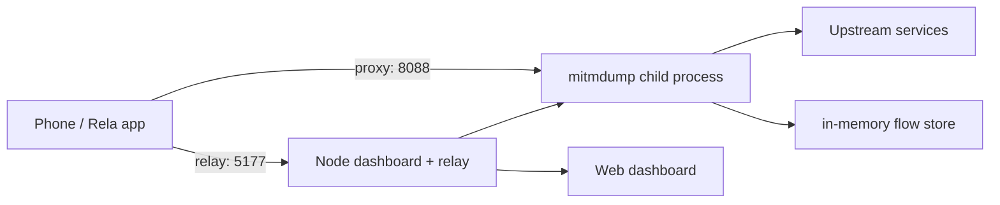

# Any Proxy Docker Deployment Design

## Purpose

Package `any_proxy` as a Docker-deployable service for Tencent Cloud CVM. The
first cloud version should let testers run the existing dashboard, Rela app
relay, and mitmproxy capture proxy on a server with a single Docker Compose
command.

The deployment is intentionally simple for this iteration: no token auth and no
IP whitelist. Public exposure is accepted for now, with clear documentation that
the proxy port must be protected in a later iteration.

## Goals

- Build a Docker image that contains Node.js, the app server, and mitmproxy.
- Run dashboard, relay, and mitmproxy from one container.
- Deploy with `docker compose up -d` on Tencent Cloud CVM.
- Expose dashboard and relay on port `5177`.
- Expose the HTTP proxy on port `8088`.
- Persist the mitmproxy CA directory across container restarts.
- Allow the public host/IP shown in onboarding and relay URLs to be configured.
- Keep local development with `npm run dev` unchanged.

## Non-Goals

- No authentication token in this iteration.
- No IP whitelist in this iteration.
- No Kubernetes, Tencent TKE, or load balancer setup.
- No automatic HTTPS certificate for the dashboard.
- No automatic phone proxy setup from the cloud deployment.
- No persistent capture database; captures remain in memory.

## Recommended Approach

Use a single image and `docker-compose.yml`.

The image installs Node.js dependencies and mitmproxy. The container starts the
existing Node server with production settings. The Node server keeps spawning
`mitmdump` as a child process, so the current process model stays intact.

This is the most direct path because the project already owns mitmproxy process
management. Splitting Node and mitmproxy into two containers would require new
IPC and certificate-directory coordination without much benefit for the first
cloud deployment.

## Runtime Architecture



The container exposes:

- `5177/tcp`: dashboard, REST API, SSE events, and `/relay/rela/*`
- `8088/tcp`: mitmproxy HTTP proxy

The server keeps using environment variables for configuration. Docker Compose
sets container defaults but allows operators to override them with `.env`.

## Cloud Address Handling

Local development can advertise a LAN IP discovered from network interfaces.
Cloud deployments need an explicit public address because container network
interfaces may only show private addresses.

Add an advertised host setting:

- `RELA_CAPTURE_ADVERTISE_HOST`
  - optional
  - example: `1.2.3.4` or `capture.example.com`
  - when set, dashboard onboarding and `/api/status` should use it for the
    dashboard, relay, proxy, QR code, and mobile setup URLs

If unset, the app keeps the existing LAN auto-detection behavior.

## Docker Image

Add a `Dockerfile` with a production-oriented build:

- Base: Node.js 22 slim image.
- Install Python/pip dependencies required by mitmproxy.
- Install mitmproxy in the image.
- Install npm dependencies with `npm ci`.
- Build TypeScript to a `dist` directory.
- Run the compiled server with `node dist/server/index.js`.

The project should add scripts:

- `build`: `tsc`
- `start:prod`: `node dist/server/index.js`

`npm run start` can remain as the local TypeScript runtime path if desired.

## Docker Compose

Add `docker-compose.yml`:

- service name: `any-proxy`
- image built from local `Dockerfile`
- restart policy: `unless-stopped`
- ports:
  - `${RELA_CAPTURE_DASHBOARD_PORT:-5177}:5177`
  - `${RELA_CAPTURE_PROXY_PORT:-8088}:8088`
- environment:
  - `RELA_CAPTURE_DASHBOARD_HOST=0.0.0.0`
  - `RELA_CAPTURE_DASHBOARD_PORT=5177`
  - `RELA_CAPTURE_PROXY_HOST=0.0.0.0`
  - `RELA_CAPTURE_PROXY_PORT=8088`
  - `RELA_CAPTURE_ADVERTISE_HOST=${RELA_CAPTURE_ADVERTISE_HOST:-}`
  - `RELA_RELAY_TARGET_ORIGIN=${RELA_RELAY_TARGET_ORIGIN:-https://api.rela.me}`
- volume:
  - `mitmproxy-ca:/app/.mitmproxy`
- healthcheck:
  - request `http://127.0.0.1:5177/api/status`

Persisting `/app/.mitmproxy` preserves the generated CA certificate and private
key. Phones that already trusted that CA should not need to reinstall it after a
container restart.

## Tencent Cloud Deployment Flow

1. Create or use a Tencent Cloud CVM instance.
2. Install Docker and Docker Compose plugin.
3. Open CVM security group inbound TCP ports:
   - `5177`
   - `8088`
4. Clone or copy the project to the server.
5. Create `.env`:

   ```bash
   RELA_CAPTURE_ADVERTISE_HOST=<server-public-ip-or-domain>
   RELA_RELAY_TARGET_ORIGIN=https://api.rela.me
   ```

6. Start:

   ```bash
   docker compose up -d --build
   ```

7. Open:

   ```text
   http://<server-public-ip-or-domain>:5177
   ```

8. Configure the Rela app debug relay endpoint:

   ```text
   http://<server-public-ip-or-domain>:5177/relay/rela
   ```

For phone system proxy testing, configure the phone proxy host as the same public
host and port `8088`, then install/trust the mitmproxy CA from `http://mitm.it`.

## Security Notes

This iteration intentionally does not add token auth or IP whitelisting.
Because port `8088` is an HTTP proxy, exposing it publicly can allow unwanted
third-party use if the address is discovered. The README must call this out
plainly and recommend limiting access with Tencent Cloud security groups or a
future app-level whitelist.

Captured requests may contain user identifiers, tokens, and private data.
Captures remain in memory and exports are explicit downloads, but operators
should still treat the dashboard as sensitive.

## Testing

Add verification for:

- Docker image can build.
- Production server starts from compiled JavaScript.
- `/api/status` works in production mode.
- `RELA_CAPTURE_ADVERTISE_HOST` changes advertised dashboard, relay, proxy, QR,
  and setup URLs.
- Existing relay tests still pass.
- Existing mitmproxy binary resolution tests still pass.

Manual cloud smoke test:

- Deploy on a Tencent Cloud CVM.
- Visit `/api/status`.
- Send a request through `/relay/rela`.
- Confirm it appears in the dashboard.
- Confirm container restart keeps `.mitmproxy` volume mounted.
